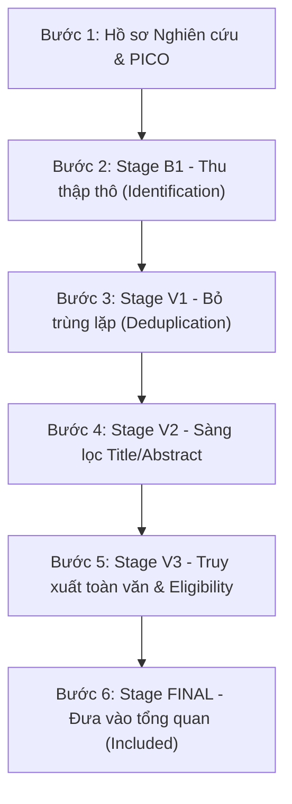

# SỔ TAY HƯỚNG DẪN SỬ DỤNG HỆ THỐNG SCHOLAR EXTRACTOR
## Quy Trình Vận Hành Tổng Quan Tài Liệu Khoa Học (SLR) Theo Chuẩn PRISMA 2020

---

## 📌 MỤC LỤC
1. [Chuẩn Bị Môi Trường & Khởi Động](#1-chuẩn-bị-môi-trường--khởi-động)
2. [Quy Trình 6 Bước Vận Hành Pipeline PRISMA 2020](#2-quy-trình-6-bước-vận-hành-pipeline-prisma-2020)
   - [Bước 1: Thiết lập Hồ sơ Nghiên cứu & Quản lý PICO](#bước-1-thiết-lập-hồ-sơ-nghiên-cứu--quản-lý-pico)
   - [Bước 2: Giai đoạn B1 - Thu thập Dữ liệu Thô (Identification)](#bước-2-giai-đoạn-b1---thu-thập-dữ-liệu-thô-identification)
   - [Bước 3: Giai đoạn V1 - Khử Trùng Lặp (Deduplication)](#bước-3-giai-đoạn-v1---khử-trùng-lặp-deduplication)
   - [Bước 4: Giai đoạn V2 - Sàng lọc Tiêu đề & Tóm tắt (Title & Abstract Screening)](#bước-4-giai-đoạn-v2---sàng-lọc-tiêu-đề--tóm-tắt-title--abstract-screening)
   - [Bước 5: Giai đoạn V3 - Truy xuất Toàn văn & Đánh giá Tư cách (Full-Text Retrieval & Eligibility)](#bước-5-giai-đoạn-v3---truy-xuất-toàn-văn--đánh-giá-tư-cách-full-text-retrieval--eligibility)
   - [Bước 6: Giai đoạn FINAL - Tổng kết Bài báo Đưa vào Tổng quan (Included Studies)](#bước-6-giai-đoạn-final---tổng-kết-bài-báo-đưa-vào-tổng-quan-included-studies)
3. [Điều Khiển Tiến Trình Nền (Background Jobs) & Khôi Phục Dữ Liệu](#3-điều-khiển-tiến-trình-nền-background-jobs--khôi-phục-dữ-liệu)
4. [Sinh Sơ Đồ PRISMA 2020 & Kiểm Chứng Nhật Ký Tìm Kiếm](#4-sinh-sơ-đồ-prisma-2020--kiểm-chứng-nhật-ký-tìm-kiếm)
5. [Xuất Dữ Liệu Báo Cáo & Danh Mục Trích Dẫn APA 7](#5-xuất-dữ-liệu-báo-cáo--danh-mục-trích-dẫn-apa-7)
6. [Các Tình Huống Xử Lý Sự Cố (FAQ)](#6-các-tình-huống-xử-lý-sự-cố-faq)

---

## 1. Chuẩn Bị Môi Trường & Khởi Động

### 1.1. Khởi động Backend Server
1. Mở PowerShell hoặc Terminal tại thư mục `backend`:
   ```powershell
   cd backend
   npm install
   npm start
   ```
2. Quan sát log trên màn hình terminal:
   - Nếu bạn có cài SQL Server:  
     `[DB] Ket noi thanh cong toi SQL Server: localhost/ScholarExtractorDB`
   - Nếu chưa cấu hình SQL Server:  
     `[DB] SQL Server chua duoc cau hinh trong .env. Chay o che do Local Fallback.`  
     *(Hệ thống vẫn chạy đầy đủ tính năng bằng bộ nhớ RAM và Snapshot tệp JSON cục bộ mà không gặp bất kỳ lỗi nào)*.
3. Địa chỉ máy chủ API mặc định: `http://localhost:3001`.

### 1.2. Mở Chrome Extension
1. Mở Google Chrome hoặc Microsoft Edge, gõ vào thanh địa chỉ: `chrome://extensions/`.
2. Bật công tắc **Developer mode** ở góc trên bên phải.
3. Nhấp **Load unpacked** và chọn thư mục: `chrome_extension`.
4. Bấm vào biểu tượng **Scholar Extractor** trên thanh tiện ích để mở cửa sổ giao diện.

---

## 2. Quy Trình 6 Bước Vận Hành Pipeline PRISMA 2020

Dưới đây là trình tự các bước thao tác chuẩn để hoàn thành một tổng quan tài liệu khoa học:



---

### Bước 1: Thiết lập Hồ sơ Nghiên cứu & Quản lý PICO

1. **Chọn hoặc chuyển đổi đề tài**:
   - Ở thanh trên cùng của Extension, chọn đề tài tại hộp chọn **🎯 Nghiên cứu**.
   - Mặc định có 3 đề tài mẫu:
     - `SWT302 REST API EP/BVA`: Kiểm thử phần mềm tự động bằng EP và BVA.
     - `Generic Literature Review`: Tổng quan tài liệu tự do, không ràng buộc năm xuất bản.
     - `Giao tiếp tử tế & Sự tự tin của trẻ khiếm thị`: Đề tài khoa học xã hội/giáo dục với từ khóa AAC.
2. **Tạo mới hoặc Tùy biến tiêu chí**:
   - Nhấn **⚙️ Quản lý Hồ sơ** $\rightarrow$ bấm **+ Tạo mới** hoặc **Sửa**.
   - Khai báo câu hỏi nghiên cứu (**RQ**), số lượng bài mục tiêu (**Target Included Count**).
   - Thiết lập cấu trúc PICO và các tiêu chí Thu nhận (**IC**) / Loại trừ (**EC**):
     - Khoảng năm xuất bản (`year_range`).
     - Số trang tối thiểu (`minPageCount`, ví dụ: $\ge 4$ trang).
     - Từ khóa bắt buộc trong Tiêu đề hoặc Tóm tắt.
   - Nhấn **Lưu Hồ sơ**. Phiên bản `profileVersion` và `protocolVersion` sẽ tự động được ghi nhận.

---

### Bước 2: Giai đoạn B1 - Thu thập Dữ liệu Thô (Identification)

1. Chuyển sang thẻ tab **Stage B1: Identification**.
2. **Chọn chuỗi tìm kiếm**:
   - Nhấp vào một trong các nút chuỗi gợi ý sẵn bên dưới ô tìm kiếm (hoặc tự gõ từ khóa nguyên văn).
   - Chọn bộ lọc năm (ví dụ: `2020` đến `2026`).
3. **Thực thi thu thập**:
   - Bấm **🔍 Lấy trang 1 (start=0)**: Khởi tạo phiên làm việc mới, lấy 10 bài đầu tiên.
   - Bấm **⏩ Lấy trang tiếp (+10)** hoặc **⚡ Lấy tối đa trang đã đặt**: Tự động phân trang thu thập tiếp các trang sau.
   - Hoặc bấm **▶️ Chạy nền stage này**: Giao việc cho Background Job tự động thu thập phân trang mà bạn không cần phải ngồi đợi.
4. **Lưu ý chuẩn PRISMA 2020**:
   - Dữ liệu thu thập từ **Google Scholar** được gắn cờ là *Candidate Papers (bổ trợ)*. Toàn bộ số liệu này được lưu vào `search-log.md` và `01_all_records.csv`, bảo đảm phân biệt rạch ròi với nhánh cơ sở dữ liệu chính thống.

---

### Bước 3: Giai đoạn V1 - Khử Trùng Lặp (Deduplication)

1. Chuyển sang thẻ tab **Stage V1: Bỏ trùng & Tiền sàng lọc**.
2. Bấm **▶️ Chạy nền stage này** (hoặc để hệ thống tự động chạy sau khi hoàn thành B1):
   - **Tầng 1 (Chính xác)**: Tự động chuẩn hóa DOI (xóa `https://doi.org/`, chuyển chữ thường) và gộp các bài trùng mã DOI thành 1 bài đại diện duy nhất (`canonicalRecord`).
   - **Tầng 2 (So khớp mờ)**: Đối chiếu tiêu đề với độ tương đồng `Title Similarity > 88%`.
   - Các bài cùng tiêu đề nhưng khác DOI hoặc chưa có DOI sẽ được **giữ lại và gắn cờ `potentialDuplicate`** để người nghiên cứu xem xét thủ công, **tuyệt đối không tự ý xóa bỏ mất dữ liệu**.
3. Kết quả: Số bản ghi duy nhất sẵn sàng đi vào vòng sàng lọc V2.

---

### Bước 4: Giai đoạn V2 - Sàng lọc Tiêu đề & Tóm tắt (Title & Abstract Screening)

1. Chuyển sang thẻ tab **Stage V2: Sàng lọc Title/Abstract**.
2. **Quy tắc phân loại tự động của Hệ thống**:
   - Huy hiệu `✓` (xanh): Đạt tiêu chí Thu nhận (IC).
   - Huy hiệu `✗` (đỏ): Vi phạm tiêu chí Loại trừ (EC) hoặc không đạt IC bắt buộc $\rightarrow$ Gợi ý **Exclude**.
   - Huy hiệu `?` (vàng): Thiếu dữ liệu abstract hoặc chưa đủ căn cứ $\rightarrow$ Gợi ý **Unsure**.
   - Chỉ khi đạt tất cả tiêu chí bắt buộc mới gợi ý **PassToFullText**.
3. **Tự động quét ngầm hàng loạt (Batch Auto-Screen)**:
   - Nhấn **⚡ Tự động quét & Sàng lọc**: Hệ thống sẽ tự động mở kết nối ngầm, trích xuất HighWire meta tags (`citation_abstract`, `citation_title`...), phân tích từ khóa và cập nhật gợi ý tự động.
4. **Thẩm định và xác nhận của Người Nghiên cứu**:
   - Nhấn **✓ Include / Pass**, **✗ Exclude**, hoặc **? Unsure** trên từng bài.
   - Nhập lý do vào ô **Ghi chú**.
   - *Lưu ý*: Mọi bài phân vân (`Unsure`) ở vòng V2 đều được hệ thống lưu vết trong `unsureTitleAbstract`, không bị ghi đè khi chuyển sang vòng V3.

---

### Bước 5: Giai đoạn V3 - Truy xuất Toàn văn & Đánh giá Tư cách (Full-Text Retrieval & Eligibility)

1. Chuyển sang thẻ tab **Stage V3: Toàn văn & Eligibility**.
2. **Thu thập báo cáo toàn văn (Full-Text Retrieval)**:
   - Hệ thống tự động truy vấn dịch vụ **Unpaywall** và **Open Access** để tìm link PDF mở.
   - Với các bài chưa có PDF tự động:
     - Nhấp **📑 Tab**: Mở tab bài báo trên trình duyệt để trích xuất nội dung trực tiếp.
     - Hoặc nhấp **📁 Tải file PDF**: Tải tệp PDF từ máy tính lên để hệ thống đếm số trang thực tế và bóc tách bảng số liệu.
   - **Xác định Paywall chuẩn xác**: Hệ thống **không bao giờ suy diễn bừa bãi** bài báo bị Paywalled chỉ vì tên nhà xuất bản IEEE/ACM/Springer; chỉ đánh dấu `isPaywalled = true` khi đã thử các nguồn mở mà không có toàn văn.
3. **Đánh giá tiêu chí toàn văn (Eligibility)**:
   - Kiểm tra số trang tối thiểu (ví dụ: $\ge 4$ trang).
   - Kiểm tra bảng/hình ảnh thực nghiệm định lượng (ví dụ: Table kết quả coverage/mutation).
   - Chọn quyết định cuối cùng cho vòng V3: **Include** hoặc **Exclude** kèm lý do cụ thể.

---

### Bước 6: Giai đoạn FINAL - Tổng kết Bài báo Đưa vào Tổng quan (Included Studies)

1. Chuyển sang thẻ tab **Stage FINAL: Báo cáo PRISMA**.
2. Toàn bộ các bài báo đạt `finalDecision = "Include"` sau vòng V3 sẽ được đưa vào danh sách tổng kết.
3. Hệ thống tự động giải phương trình cân bằng PRISMA:
   $$\text{Identification} = \text{Duplicates} + \text{Excluded Title/Abstract} + \text{Not Retrieved} + \text{Excluded Full-Text} + \text{Included}$$
   Bảo đảm không có sai lệch số lượng hoặc mất dấu bản ghi.

---

## 3. Điều Khiển Tiến Trình Nền (Background Jobs) & Khôi Phục Dữ Liệu

Khi bạn bấm **▶️ Chạy nền stage này**, banner điều khiển tiến trình nền sẽ xuất hiện ở đầu trang:

| Nút điều khiển | Tác dụng |
| :--- | :--- |
| **⏸️ Tạm dừng (Pause)** | Dừng tạm thời công việc tại bài báo hiện tại mà không làm mất tiến độ đã làm. |
| **▶️ Tiếp tục (Resume)** | Tiếp tục xử lý tiếp từ bài báo kế tiếp mà không phải quét lại từ đầu. |
| **⏹️ Hủy (Cancel)** | Hủy bỏ tiến trình nền một cách an toàn. |

### 🔒 Cơ Chế Snapshot Khôi Phục Tự Động (Crash Persistence)
- Cứ sau mỗi mẻ xử lý, trạng thái toàn bộ các bài báo và tiến trình được tự động lưu ra tệp Snapshot tại thư mục `backend/data/snapshots/` và bảng `PipelineSnapshots` trên SQL Server.
- Nếu bạn tắt trình duyệt, mất mạng hoặc khởi động lại backend, toàn bộ dữ liệu stage sẽ **tự động phục hồi nguyên vẹn 100%** khi mở lại tiện ích.

---

## 4. Sinh Sơ Đồ PRISMA 2020 & Kiểm Chứng Nhật Ký Tìm Kiếm

### 4.1. Lấy Sơ Đồ PRISMA 2020 Tự Động
Gửi yêu cầu tới API backend (hoặc xem trực tiếp trên tab Stage FINAL):
```text
GET http://localhost:3001/api/prisma/flow?researchId=preset_swt302
```
Hệ thống sẽ trả về:
- Mã **Mermaid Flowchart** chuẩn PRISMA 2020 để dán trực tiếp vào báo cáo LaTeX hoặc Markdown.
- Bảng kê số lượng từng nhánh:
  - Records identified from databases ($n = \dots$)
  - Duplicate records removed ($n = \dots$)
  - Records screened ($n = \dots$) / Excluded ($n = \dots$)
  - Reports sought for retrieval ($n = \dots$) / Reports not retrieved ($n = \dots$)
  - Reports assessed for eligibility ($n = \dots$) / Excluded ($n = \dots$ kèm lý do)
  - Studies included in review ($n = \dots$)

### 4.2. Nhật Ký Kiểm Chứng Tìm Kiếm (`search-log.md`)
Mọi phiên tìm kiếm đều được tự động lưu vào tệp [search-log.md](file:///c:/Users/ThanhDuy/Documents/03_Tool_Configs/extension/search-log.md) ở thư mục gốc:
- Ghi nhận nguyên văn câu truy vấn và các tham số lọc (`as_ylo`, `as_yhi`, `hl`).
- Đối chiếu số lượng web báo (`uiTotalResults`) với số bài thu thập thực tế (`collectedCount`).
- Bảng kiểm chứng 5 bản ghi đối chiếu ngẫu nhiên về Tiêu đề, Năm, Tác giả, Venue và DOI.

---

## 5. Xuất Dữ Liệu Báo Cáo & Danh Mục Trích Dẫn APA 7

Tại thanh công cụ cuối giao diện Extension, nhấp vào các nút tương ứng để tải tệp về:

1. **📥 01_all_records.csv (PRISMA)**:
   - Bảng 10 cột chuẩn: `id, source, title, authors, year, venue, doi, abstract, url, retrieval_date`.
   - Có UTF-8 BOM, mở trực tiếp bằng Microsoft Excel không bị lỗi phông tiếng Việt.
   - An toàn tuyệt đối: Đã khử mã độc CSV Formula Injection.
2. **📑 Xuất Sàng lọc Đầy đủ (02_screening_decisions_full.csv)**:
   - Bao gồm toàn bộ quyết định qua từng vòng (V1, V2, V3, FINAL), trạng thái truy xuất toàn văn và các đoạn trích bằng chứng phương pháp.
3. **📖 Xuất References APA 7th (03_references_apa7.txt)**:
   - Danh mục tài liệu tham khảo được format chính xác theo quy chuẩn APA 7th Edition:
     - Tên tác giả đảo ngược (Họ, Chữ lót viết tắt).
     - Năm xuất bản trong ngoặc đơn.
     - Tiêu đề bài báo in hoa chữ cái đầu.
     - Tên hội thảo/tạp chí và DOI hợp lệ dạng `https://doi.org/...`.
   - Phân tách rõ ràng giữa bài đủ điều kiện và danh sách bài thiếu trường cần tra cứu bổ sung (không tự bịa đặt dữ liệu).
4. **📦 Tải Session JSON**:
   - Tệp JSON sao lưu toàn diện dùng để chia sẻ dữ liệu nghiên cứu cho thành viên khác trong nhóm hoặc lưu trữ dự phòng.

---

## 6. Các Tình Huống Xử Lý Sự Cố (FAQ)

### Q1: Thông báo `[DB] SQL Server chua duoc cau hinh trong .env. Chay o che do Local Fallback` nghĩa là sao?
- **Trả lời**: Đây là thông báo hệ thống đang chạy ở chế độ **Tệp cục bộ & RAM an toàn**. Hệ thống vẫn hoạt động đầy đủ 100% tính năng. Nếu muốn chuyển sang lưu vào Microsoft SQL Server thật, bạn chỉ cần mở file `backend/.env` và điền cấu hình `DB_SERVER`, `DB_NAME`, `DB_USER`, `DB_PASSWORD`.

### Q2: Google Scholar xuất hiện thông báo CAPTCHA / Robot verification?
- **Trả lời**: Khi thu thập số lượng lớn bài báo trực tiếp từ Google Scholar, Google có thể yêu cầu xác thực. Hãy sử dụng SerpApi thông qua khóa `SERPAPI_KEY` trong `.env` để thu thập tự động mà không bao giờ bị chặn CAPTCHA.

### Q3: Tôi đổi tiêu chí nghiên cứu thì các bài tôi đã bấm "Include" có bị mất không?
- **Trả lời**: **Không bao giờ bị mất**. Hệ thống tuân thủ nguyên tắc tôn trọng thẩm định của con người:
  - Quyết định thủ công của bạn (`finalDecision`) được bảo toàn tuyệt đối.
  - Hệ thống chỉ đánh dấu cờ `isDecisionOutdated = true` để thông báo cho bạn biết bài báo này cần được xem lại theo phiên bản tiêu chí mới.

### Q4: Làm sao để kiểm tra độ tin cậy của mã nguồn?
- **Trả lời**: Mở PowerShell tại thư mục `backend` và chạy lệnh:
  ```powershell
  npm test
  ```
  Hệ thống sẽ chạy qua 87 kịch bản kiểm thử độc lập (bao gồm các ca kiểm thử biên, bảo mật chống SSRF, thuật toán khử trùng lặp và tính cân bằng số học PRISMA), đạt **87/87 Pass**.

---
*Tài liệu được cập nhật tự động đồng bộ với phiên bản Scholar Extractor v2.0.0 (PRISMA 2020 Compliant).*
