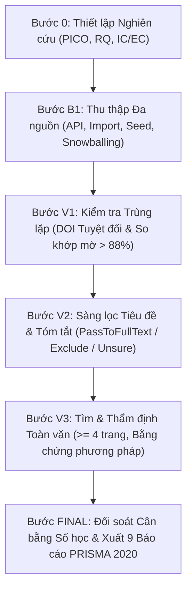
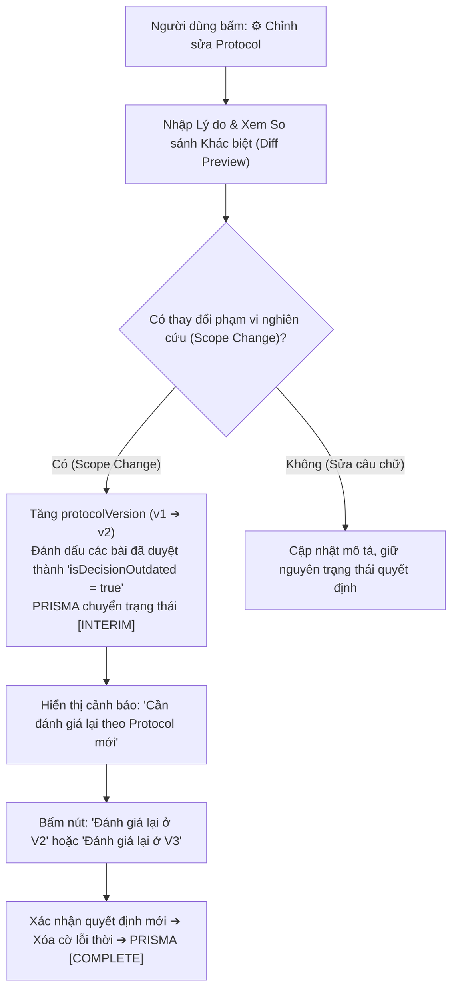

# SỔ TAY HƯỚNG DẪN SỬ DỤNG SCHOLAR EXTRACTOR (WIZARD 6 BƯỚC)
## Nền Tảng Hỗ Trợ Tổng Quan Tài Liệu Khoa Học (SLR) Theo Chuẩn PRISMA 2020

---

## 📌 MỤC LỤC
1. [Giới Thiệu Luồng Sử Dụng Mới: Wizard Có Hướng Dẫn Từng Bước](#1-giới-thiệu-luồng-sử-dụng-mới-wizard-có-hướng-dẫn-từng-bước)
2. [Thẻ Thông Tin Bước Hợp Nhất (Step Header Card)](#2-thẻ-thông-tin-bước-hợp-nhất-step-header-card)
3. [Quy Trình 6 Bước Vận Hành Chi Tiết](#3-quy-trình-6-bước-vận-hành-chi-tiết)
   - [Bước 0 — Thiết lập Nghiên cứu & Protocol (SETUP)](#bước-0--thiết-lập-nghiên-cứu--protocol-setup)
   - [Bước B1 — Thu thập Bài báo (Identification)](#bước-b1--thu-thập-bài-báo-identification)
   - [Bước V1 — Kiểm tra Trùng lặp (Deduplication)](#bước-v1--kiểm-tra-trùng-lặp-deduplication)
   - [Bước V2 — Sàng lọc Tiêu đề & Tóm tắt (Screening)](#bước-v2--sàng-lọc-tiêu-đề--tóm-tắt-screening)
   - [Bước V3 — Tìm & Thẩm định Toàn văn (Eligibility)](#bước-v3--tìm--thẩm-định-toàn-văn-eligibility)
   - [Bước FINAL — Chốt Danh Sách & Xuất Báo Cáo PRISMA 2020](#bước-final--chốt-danh-sách--xuất-báo-cáo-prisma-2020)
4. [Bảng Tra Cứu Thao Tác Cho Mọi Tình Huống Đặc Biệt](#4-bảng-tra-cứu-thao-tác-cho-mọi-tình-huống-đặc-biệt)
5. [Sơ Đồ Luồng Pipeline & Sơ Đồ Quản Trị Đổi Protocol](#5-sơ-đồ-luồng-pipeline--sơ-đồ-quản-trị-đổi-protocol)
6. [Quản Lý Tiến Trình Nền & Phục Hồi Khi Đóng/Mở Extension](#6-quản-lý-tiến-trình-nền--phục-hồi-khi-đóngmở-extension)
7. [Danh Mục 9 Tệp Dữ Liệu Xuất Bản Chuẩn Học Thuật](#7-danh-mục-9-tệp-dữ-liệu-xuất-bản-chuẩn-học-thuật)
8. [Cài Đặt & Khởi Động Hệ Thống](#8-cài-đặt--khởi-động-hệ-thống)

---

## 1. Giới Thiệu Luồng Sử Dụng Mới: Wizard Có Hướng Dẫn Từng Bước

Phiên bản mới của **Scholar Extractor** đã được chuyển đổi hoàn toàn từ giao diện nhiều tab độc lập sang **Quy trình Wizard 6 bước tuyến tính có hướng dẫn**:

```text
[0. Thiết lập] ➔ [B1. Thu thập] ➔ [V1. Bỏ trùng] ➔ [V2. Tiêu đề & Tóm tắt] ➔ [V3. Toàn văn] ➔ [✓. Chốt & Xuất]
```

### Các nguyên tắc giao diện then chốt:
1. **Toàn bộ bằng Tiếng Việt**: Ngôn từ chuẩn xác, gần gũi với sinh viên và nghiên cứu viên thực hiện Systematic Literature Review (SLR).
2. **Không gây hoang mang nút bấm**: Thay vì nút chung *"Chạy Giai Đoạn Hiện Tại"*, mỗi bước hiển thị **Một nút hành động chính (Primary Action Button)** với tên cụ thể và biểu tượng rõ ràng.
3. **Phân định rạch ròi 4 thành phần**:
   - 🤖 **Gợi ý tự động của tool**: Luôn hiển thị lý do chấm điểm; không tự động biến thành quyết định thủ công của người dùng.
   - 👤 **Quyết định của người dùng**: Bảo lưu nguyên vẹn, chỉnh sửa ghi chú không bao giờ làm mất hay thay đổi quyết định đã chọn.
   - 📄 **Trạng thái tài liệu**: Phân biệt rành mạch *"Đang tìm"*, *"Đã tải PDF"*, *"Chưa tìm thấy"*, *"Lỗi mạng"* với *"Đã thẩm định chuyên sâu"*. Thiếu toàn văn KHÔNG tự động đồng nghĩa với loại trừ!
   - 🏁 **Trạng thái hoàn tất**: Hiển thị rõ số lượng bài Chưa xử lý, Chờ xác nhận và Đã hoàn tất ở mỗi vòng.
4. **Bảo tồn dữ liệu khi quay lại bước trước**: Người dùng hoàn toàn tự do bấm vào các nút stepper để xem lại dữ liệu các bước trước đó mà không làm mất trạng thái làm việc.

---

## 2. Thẻ Thông Tin Bước Hợp Nhất (Step Header Card)

Ở trên cùng của mọi màn hình làm việc (luôn hiển thị), thẻ **Step Header Card** cung cấp đầy đủ ngữ cảnh:

- **Tên nghiên cứu & Phiên bản Protocol**: Ví dụ: `SWT302 REST API` | `v1.0`.
- **🎯 Mục tiêu của bước**: Mô tả ngắn gọn nhiệm vụ trọng tâm của bước hiện tại.
- **🔄 Luồng Dữ liệu (I/O)**: Nêu rõ dữ liệu đầu vào và kết quả đầu ra mong đợi.
- **Thanh 4 chỉ số tiến độ**:
  - 🟡 **Chưa xử lý (Pending)**: Số bài báo hoặc tác vụ còn đang chờ thực hiện.
  - 🔵 **Chờ xác nhận (Review / Unsure)**: Số bài cần người nghiên cứu trực tiếp xem xét hoặc các bài có độ nghi ngờ.
  - 🟢 **Đã hoàn tất (Completed)**: Số bản ghi đã phân loại xong trong bước hiện tại.
  - 🟣 **Mục tiêu Include**: Tỉ lệ hoàn thành mục tiêu số bài đưa vào tổng quan (ví dụ: `12 / 15 bài`). *Lưu ý: Chỉ số này dùng để theo dõi tiến độ, hệ thống tuyệt đối không tự ý ép Include/Exclude để đạt chỉ tiêu.*
- **Nút hành động chính (Primary Button)**: Tự động đổi tên và hành động tương ứng với bước đang làm việc.
- **📋 Điều kiện để tiếp tục**: Điều kiện bắt buộc để có thể chuyển sang bước sau.
- **👉 Hướng dẫn bước tiếp theo**: Chỉ dẫn cụ thể thao tác tiếp theo.
- **Nút "ℹ️ Hướng dẫn bước này"**: Mở hộp thoại giải đáp tức thì 6 câu hỏi chuẩn tắc về bước hiện tại.

---

## 3. Quy Trình 6 Bước Vận Hành Chi Tiết

### Bước 0 — Thiết lập Nghiên cứu & Protocol (SETUP)

#### A. Khi bắt đầu:
Người dùng chọn 1 trong 3 chế độ:
1. **➕ Tạo nghiên cứu mới**: Khai báo đề tài, RQ, khung PICO và tiêu chí từ đầu.
2. **📁 Tiếp tục nghiên cứu**: Chọn một hồ sơ đề tài đã lưu từ danh sách thả xuống.
3. **📥 Nhập bản sao lưu**: Phục hồi toàn bộ trạng thái làm việc từ tệp `session_backup.json`.

#### B. Khai báo Đề tài & Khung Phân Tích:
- **Tên đề tài & Mô tả**: Nhập tên môn học, phạm vi nghiên cứu.
- **Câu hỏi RQ (Research Questions)**: Mỗi dòng 1 câu hỏi (ví dụ: `RQ1: Các kỹ thuật kiểm thử tự động nào dựa trên EP/BVA?`).
- **Khung phân tích (Framework)**:
  - Cho phép chọn: `PICO`, `PICOS`, `SPIDER` hoặc `Custom`.
  - Hỗ trợ đánh dấu **N/A (Không áp dụng)** cho từng trường (ví dụ: trong ngành Công nghệ phần mềm, trường Comparison $C$ thường là N/A).
- **Bộ lọc & Tiêu chí Lựa chọn**:
  - Khung năm xuất bản (ví dụ: `2020` đến `2026`).
  - Ngôn ngữ (ví dụ: `English, Tiếng Việt`).
  - Số trang tối thiểu: Mặc định `4` trang (bài dưới 4 trang bị loại theo tiêu chí `EC-S`).
  - Từ khóa bắt buộc (Inclusion Keywords) & Từ khóa loại trừ (Exclusion Keywords).
  - Mục tiêu số bài đưa vào Tổng quan (`Target Included Count`).
- **Bảng Trạng Thái Nguồn Thực Tế**:
  - Hiển thị tình trạng hoạt động thực tế của OpenAlex (Miễn phí), Semantic Scholar, Google Scholar (SerpApi), và Nhập tệp ngoại vi.
  - Ưu tiên phương án miễn phí, không tự ý chuyển sang dịch vụ tính phí.
- **Xem trước bản tổng hợp (Summary Preview)**: Hệ thống tự động tạo bản tóm tắt protocol trước khi lưu.

👉 **Nút chính**: `💾 Lưu thiết lập & Sang thu thập`  
👉 **Điều kiện đi tiếp**: Đã nhập tên đề tài, ít nhất 1 câu hỏi RQ và từ khóa chính.

---

### Bước B1 — Thu thập Bài báo (Identification)

#### A. Cấu hình & Chạy Thu Thập:
1. **Chọn nguồn thu thập**:
   - `OpenAlex` (Mặc định — Miễn phí, đầy đủ tính năng phân trang cursor).
   - `Semantic Scholar` (Nguồn bổ trợ, tự động fallback nếu không có API key).
   - `Google Scholar` (SerpApi — Thu thập bài ứng viên bổ trợ).
   - `Nhập tệp ngoại vi` (Hỗ trợ CSV, BibTeX `.bib`, RIS `.ris` theo khả năng parser thực tế).
2. **Chọn chuỗi truy vấn**:
   - Bấm vào một trong các chuỗi gợi ý bên dưới ô tìm kiếm (sinh từ PICO và từ khóa protocol).
   - Hoặc tự nhập chuỗi tìm kiếm nguyên văn.
3. **Thực thi**:
   - Bấm **`🔍 Bắt đầu thu thập bài báo`**.
   - Có thể bấm **`🎯 Thêm bài seed / DOI`** để nạp trực tiếp bài báo hạt giống.
   - Hoặc bấm **`❄️ Snowballing`** để truy vết trích dẫn ngược (References) hoặc xuôi (Citations).

#### B. Trong lúc thu thập & Quản lý Tiến trình nền:
- Thanh tiến trình hiển thị rõ nguồn, truy vấn đang xử lý, số trang và số bản ghi đã nhận.
- Hỗ trợ các nút: **`⏸ Tạm dừng`**, **`▶ Tiếp tục`**, **`⏹ Hủy tác vụ`**.
- *Ghi chú quan trọng*: Tác vụ chạy trên backend Node.js độc lập; tiến trình vẫn tiếp tục ngay cả khi bạn đóng popup hoặc chuyển tab.

#### C. Khi hoàn tất:
- Hiển thị bảng tổng kết số bản ghi theo từng nguồn và các lượt lỗi nếu có.
- Có các nút hỗ trợ: **`🔄 Chạy lại phần lỗi`** và **`➕ Thu thập thêm`** (thu thập thêm bảo toàn dữ liệu cũ, không tính bản ghi đã có thành phát hiện mới).

👉 **Nút chính**: `🔍 Bắt đầu thu thập bài báo`  
👉 **Nút tiếp theo**: `➡️ Sang kiểm tra trùng lặp (V1)`  
👉 **Điều kiện đi tiếp**: Có ít nhất 1 bài báo hợp lệ trong tập dữ liệu B1.

---

### Bước V1 — Kiểm tra Trùng lặp (Deduplication)

#### A. Hiển thị 4 Thẻ Số Liệu:
- **Tổng bản ghi thô**: Toàn bộ bài báo nhận được từ B1.
- **Trùng chắc chắn (DOI)**: Số bài trùng tuyệt đối mã DOI đã được tự động loại bỏ.
- **Nghi trùng cần duyệt**: Số cặp bài báo có độ tương đồng tiêu đề cao ($> 88\%$) nhưng khác DOI hoặc chưa có DOI.
- **Bản ghi duy nhất**: Số bài báo còn lại sau khi xử lý.

#### B. Xem xét Nhóm Nghi Trùng Cạnh Nhau (Side-by-Side):
Với mỗi cặp bài báo nghi trùng, giao diện hiển thị 2 cột cạnh nhau gồm Tiêu đề, Tác giả, Năm, Venue, DOI và Nguồn gốc:
- Bấm **`🔗 Gộp bản ghi`**: Gộp bản ghi B vào bản ghi chính A, bổ sung nguồn gốc vào danh sách provenance. **Tuyệt đối không xóa vĩnh viễn dữ liệu gốc**.
- Bấm **`⚖️ Giữ riêng`**: Xác nhận 2 bài này là hai nghiên cứu độc lập khác nhau, giữ nguyên cả 2.
- Bấm **`👁️ Xem nguồn`**: Xem chi tiết nguồn của từng bài.
- Cho phép **Hoàn tác gộp (Unmerge)** bất cứ lúc nào để khôi phục trạng thái ban đầu.

👉 **Nút chính**: `✨ Kiểm tra trùng lặp (Chạy Dedup)`  
👉 **Nút tiếp theo**: `✓ Xác nhận kết quả bỏ trùng & sang V2 ➔`  
👉 **Điều kiện đi tiếp**: Tất cả các cặp nghi trùng đã được xử lý (gộp hoặc giữ riêng).

---

### Bước V2 — Sàng lọc Tiêu đề & Tóm tắt (Screening)

#### A. Thông tin hiển thị tinh gọn:
Chỉ hiển thị các thông tin cần thiết cho vòng này: Tiêu đề, Tác giả, Năm, Venue, DOI, Tóm tắt trích xuất (Abstract) và Huy hiệu tiêu chí đối chiếu.

#### B. Ba quyết định duy nhất tại V2:
Với mỗi bài báo, người nghiên cứu đưa ra 1 trong 3 quyết định:
1. **`✓ Qua vòng toàn văn`** $\rightarrow$ Gán trạng thái `PassToFullText`.
2. **`✗ Loại ở V2`** $\rightarrow$ Gán trạng thái `Exclude`, kèm hộp thoại nhập lý do loại trừ (ví dụ: *EC1: Không liên quan đến kiểm thử tự động*).
3. **`? Chưa rõ`** $\rightarrow$ Gán trạng thái `Unsure`.

> ⚠️ **Quy tắc liêm chính học thuật**: Tuyệt đối **KHÔNG dùng nhãn "Include cuối cùng"** tại V2! Các bài qua vòng V2 chỉ mới đạt điều kiện đọc toàn văn ở V3.  
> Gợi ý tự động của hệ thống (⚡ Tự động quét & Sàng lọc) chỉ đóng vai trò khuyến nghị khoa học, không tự ý biến thành quyết định thủ công của người dùng.

#### C. Thanh lọc Pills:
- `Tất cả` | `Chưa xem` | `Qua vòng toàn văn` | `Đã loại` | `Chưa rõ`.

#### D. Xử lý bài báo Unsure:
Nếu còn bài báo ở trạng thái `Unsure`, hộp thoại hướng dẫn xuất hiện với 2 phương án:
- **Tiếp tục xem lại ở V2**: Lọc lại các bài Unsure để đọc kỹ abstract.
- **Đưa bài Unsure sang V3 để kiểm tra toàn văn**: Cho phép chuyển các bài chưa rõ sang V3 để đọc bản PDF toàn văn mà **không ép người dùng phải loại bài chỉ để đi tiếp**.

👉 **Nút chính**: `⚡ Tự động quét & Sàng lọc`  
👉 **Nút tiếp theo**: `✓ Xác nhận danh sách sang V3 ➔`  
👉 **Điều kiện đi tiếp**: Không còn bài báo nào ở trạng thái Chưa xem.

---

### Bước V3 — Tìm & Thẩm định Toàn văn (Eligibility)

Bước này được phân định rõ thành 2 công việc nối tiếp nhau:

#### Phân hệ A: Thu thập Toàn văn (Document Retrieval)
- Bấm **`📑 Tìm toàn văn cho các bài đã chọn`**: Hệ thống tự động tra cứu Unpaywall và kho mở Open Access để tìm link tải PDF.
- Hiển thị riêng biệt các trạng thái:
  - 🔄 **Đang tìm kiếm**: Hệ thống đang gửi yêu cầu kiểm tra.
  - 🟢 **Đã tải PDF**: Đã có tệp PDF và tự động đếm số trang thực tế.
  - ⚪ **Chưa tìm thấy PDF**: Không có bản Open Access công khai.
  - 🔴 **Lỗi mạng**: Lỗi kết nối tạm thời, có nút **Thử tải lại**.
  - 🟡 **Paywall**: Cần truy cập qua tài khoản trường/tổ chức. *(Lưu ý: Không suy đoán paywall chỉ từ tên miền IEEE/ACM/Springer)*.
- Hỗ trợ tải thủ công:
  - **`📁 Tải file PDF từ máy`**: Gắn trực tiếp tệp PDF tải từ thư viện trường vào bài báo.
  - **`📑 Lấy từ Tab đang mở`**: Trích xuất nội dung bài báo từ tab trình duyệt đang mở.
- *Nguyên tắc cốt lõi*: **Thiếu toàn văn KHÔNG tự động đồng nghĩa với Loại trừ (Exclude)**.

#### Phân hệ B: Đọc & Thẩm định Tư cách Toàn văn (Eligibility Assessment)
- Đọc bài báo và đối chiếu với tiêu chí protocol:
  - Kiểm tra số trang: Bắt buộc $\ge 4$ trang. Bài dưới 4 trang bị loại theo `EC-S`.
  - Trích xuất đoạn văn bằng chứng phương pháp (Evidence snippet), số trang và vị trí trích dẫn.
  - Phân biệt rõ giữa *"Đã tải PDF"* với *"Đã thẩm định"*.
- Ba nút quyết định thẩm định:
  - **`✓ Đạt tiêu chí toàn văn`** $\rightarrow$ Gán `finalDecision = "Include"`.
  - **`✗ Loại ở V3`** $\rightarrow$ Gán `finalDecision = "Exclude"` kèm lý do cụ thể (ví dụ: *Dưới 4 trang*, *Thiếu thực nghiệm định lượng*).
  - **`? Cần bổ sung bằng chứng`** $\rightarrow$ Gán `finalDecision = "Unsure"`.
- Nhập ghi chú thẩm định vào ô **Ghi chú**: Lưu tự động từng phần, an toàn tuyệt đối, không làm thay đổi quyết định đã chọn.

👉 **Nút chính**: `📑 Tìm toàn văn cho các bài đã chọn`  
👉 **Nút tiếp theo**: `✓ Xác nhận danh sách sang Chốt & Xuất ➔`  
👉 **Điều kiện đi tiếp**: Các bài muốn chọn vào nghiên cứu phải có toàn văn và trích dẫn bằng chứng phương pháp.

---

### Bước FINAL — Chốt Danh Sách & Xuất Báo Cáo PRISMA 2020

#### A. Bảng Đối Soát Tính Toàn Vẹn PRISMA:
Trước khi xuất báo cáo, hệ thống đối soát tự động 5 tiêu chí:
1. 🟢 **Đủ điều kiện chốt Include**: Đã duyệt Include + có toàn văn + $\ge 4$ trang + có bằng chứng.
2. 🟡 **Chưa có quyết định cuối**: Các bài còn đang bỏ ngỏ ở V3.
3. 🟡 **Chưa lấy được toàn văn**: Các bài Include nhưng chưa có PDF đính kèm.
4. 🟡 **Thiếu bằng chứng phương pháp**: Các bài Include nhưng chưa có trích dẫn minh chứng.
5. 🔴 **Quyết định thuộc protocol cũ**: Các bài có quyết định thuộc phiên bản protocol cũ cần thẩm định lại.

#### B. Sơ Đồ Luồng PRISMA 2020 Cân Bằng Số Học:
Bấm **`📊 Xem Sơ Đồ Luồng PRISMA 2020 (Đối soát)`** để mở hộp thoại ma trận 5 giai đoạn:
- Phân biệt minh bạch kết quả **Tạm thời [INTERIM]** (khi còn bài chưa thẩm định hoặc thuộc protocol cũ) với kết quả **Hoàn tất [COMPLETE]**.
- Cân bằng số học tuyệt đối:
  $$\text{Tổng nhận diện (B1)} - \text{Trùng lặp (V1)} - \text{Loại tại V2} - \text{Loại tại V3} = \text{Final Included}$$
- Mọi con số đều có thể nhấp chuột (**Clickable Drilldown**) để xem danh sách bài báo tương ứng.

#### C. Xuất Dữ Liệu 9 Định Dạng Học Thuật:
Mỗi lựa chọn xuất có mô tả nội dung chi tiết, định dạng UTF-8 BOM và nhãn phiên bản rõ ràng:
1. `01_all_records.csv`: Toàn bộ 10 cột metadata bản ghi thô.
2. `01_duplicate_log.csv`: Nhật ký loại trùng lặp chi tiết.
3. `02_screening_decisions_full.csv`: Toàn bộ quyết định V1, V2, V3 kèm lý do loại trừ.
4. `03_final_included.csv`: Danh mục bài báo chính thức được đưa vào tổng quan.
5. `prisma-flow.md`: Mã Mermaid Flowchart PRISMA 2020 dán vào báo cáo.
6. `evidence-table.md`: Bảng trích xuất bằng chứng tổng hợp trích đoạn & số trang.
7. `03_references_apa7.txt`: Danh mục tài liệu tham khảo chuẩn APA 7th Edition.
8. `search-log.md`: Nhật ký tìm kiếm khoa học trung thực & lịch sử thay đổi protocol.
9. `session_backup.json`: Bản sao lưu toàn diện phiên làm việc.

---

## 4. Bảng Tra Cứu Thao Tác Cho Mọi Tình Huống Đặc Biệt

| Tình huống thực tế | Thao tác thực hiện | Nút cần bấm | Bước tiếp theo |
| :--- | :--- | :--- | :--- |
| **Đổi PICO / RQ / Tiêu chí khi đã có kết quả** | Nhập lý do thay đổi, kiểm tra Diff so sánh, đánh dấu nếu là thay đổi phạm vi | `⚙️ Chỉnh sửa Protocol` $\rightarrow$ `💾 Xác nhận & Cập nhật` | Bấm `Đánh giá lại ở V2` hoặc `V3` để rà soát các bài bị ảnh hưởng |
| **Đóng popup, chuyển tab khi đang thu thập** | Mở lại popup, hệ thống tự động nhận diện và khôi phục Job đang chạy | Xem thanh tiến trình nền `jobControlBanner` ở đầu trang | Chờ Job hoàn tất hoặc bấm `⏸ Tạm dừng` / `⏹ Hủy` |
| **Backend bị tắt hoặc restart giữa chừng** | Khởi động lại backend, mở extension, hệ thống khôi phục từ Checkpoint | `Tiếp tục từ Checkpoint` | Tiếp tục quy trình bình thường từ điểm gián đoạn |
| **API lỗi mạng hoặc hết hạn ngạch (quota)** | Giữ nguyên dữ liệu đã có, kiểm tra nguồn lỗi, thử lại hoặc chuyển nguồn | `🔄 Chạy lại phần lỗi` hoặc `📂 Nhập tệp mẫu` | Bổ sung thêm bài báo vào tập B1 mà không làm mất bài cũ |
| **Còn bài Unsure sau khi duyệt tiêu đề/tóm tắt** | Không ép loại bài; đưa sang V3 để tìm toàn văn kiểm tra kỹ hơn | `Đưa bài Unsure sang V3 để kiểm tra toàn văn` | Chuyển sang V3 đọc bản PDF toàn văn |
| **Thu thập thêm bài báo sau khi đã sang V2/V3** | Bài mới tự động đi qua V1/V2; các bài cũ giữ nguyên quyết định hợp lệ | `➕ Thu thập thêm` $\rightarrow$ `➡️ Sang kiểm tra trùng lặp` | Lọc bài mới để duyệt, bài cũ không cần duyệt lại |
| **Không tìm thấy bài nào hoặc 0 bài Included** | Kiểm tra nguyên nhân, không tự ý nới lỏng tiêu chí; xuất báo cáo ghi nhận trung thực | `📊 Xem Sơ Đồ Luồng PRISMA` $\rightarrow$ Xuất báo cáo | Hoàn tất nghiên cứu với 0 bài Included hợp lệ |

---

## 5. Sơ Đồ Luồng Pipeline & Sơ Đồ Quản Trị Đổi Protocol

### Sơ Đồ Luồng Chính 6 Bước Wizard PRISMA 2020:


### Sơ Đồ Luồng Quản Trị Thay Đổi Protocol (Diff & Re-Screening):


---

## 6. Quản Lý Tiến Trình Nền & Phục Hồi Khi Đóng/Mở Extension

1. **Vận hành trên Backend**:
   - Khi chạy thu thập nhiều trang hoặc chạy Dedup hàng loạt, tác vụ được quản lý qua `BackgroundJobs`.
   - Backend tiếp tục chạy độc lập trên máy chủ ngay cả khi người dùng đóng popup hoặc đổi sang tab khác.
2. **Khôi phục trạng thái tức thì**:
   - Khi mở lại popup, Extension tự động gọi `GET /api/jobs/active?researchId=...` để nối lại tiến trình nền đang chạy, hiển thị thanh phần trăm và cho phép Tạm dừng / Tiếp tục / Hủy.
3. **Cơ chế Snapshot Checkpoint**:
   - Sau mỗi bước quan trọng, dữ liệu được đồng bộ xuống SQL Server và tệp Snapshot JSON (`backend/data/snapshots/`).
   - Nếu backend restart, dữ liệu được nạp lại tự động 100%, không bị mất mát hay tính trùng lặp số phát hiện.

---

## 7. Danh Mục 9 Tệp Dữ Liệu Xuất Bản Chuẩn Học Thuật

| Tên tệp | Định dạng | Mục đích sử dụng | Tiêu chuẩn đảm bảo |
| :--- | :--- | :--- | :--- |
| **01_all_records.csv** | CSV (UTF-8 BOM) | Lưu trữ toàn bộ bản ghi thô từ B1 | 10 cột PRISMA, an toàn chống CSV Injection |
| **01_duplicate_log.csv** | CSV (UTF-8 BOM) | Nhật ký các cặp trùng DOI và so khớp mờ | Ghi nhận chi tiết provenance và lý do loại |
| **02_screening_decisions_full.csv** | CSV (UTF-8 BOM) | Báo cáo chi tiết quyết định qua các vòng V1, V2, V3 | Đầy đủ tiêu chí đạt/không đạt, lý do loại trừ |
| **03_final_included.csv** | CSV (UTF-8 BOM) | Danh mục bài báo chính thức được đưa vào tổng quan | Chỉ gồm các bài đạt toàn văn $\ge 4$ trang và có bằng chứng |
| **prisma-flow.md** | Markdown & Mermaid | Sơ đồ luồng PRISMA 2020 và bảng cân bằng số học | Dán trực tiếp vào báo cáo, luận văn hoặc bài báo khoa học |
| **evidence-table.md** | Markdown Table | Bảng tổng hợp dữ liệu trích đoạn phương pháp | Cột: Tác giả, Năm, Mục tiêu, Phương pháp, Số trang, Trích dẫn |
| **03_references_apa7.txt** | Plain Text | Danh mục tài liệu tham khảo theo chuẩn APA 7 | Định dạng: Tác giả, Năm, Tên bài, Venue, DOI liên kết |
| **search-log.md** | Markdown | Nhật ký thực thi tìm kiếm khoa học trung thực | Ghi nhận câu query thực tế, thời gian, số lượng đối chiếu |
| **session_backup.json** | JSON | Sao lưu toàn diện phiên làm việc | Dùng để khôi phục hoặc chia sẻ cho đồng tác giả |

---

## 8. Cài Đặt & Khởi Động Hệ Thống

### 8.1. Khởi động Backend
```powershell
cd backend
npm install
npm run dev
```
- Cổng dịch vụ mặc định: `http://localhost:3001`.
- Kiểm tra sức khỏe hệ thống: `http://localhost:3001/api/health`.

### 8.2. Biên dịch & Cài đặt Chrome Extension
```powershell
cd chrome_extension
npm install
npm run build
```
1. Mở trình duyệt Chrome/Edge $\rightarrow$ truy cập `chrome://extensions/`.
2. Bật **Developer mode** (Chế độ dành cho nhà phát triển).
3. Bấm **Load unpacked** $\rightarrow$ chọn thư mục `chrome_extension`.
4. Ghim tiện ích và bấm vào biểu tượng để bắt đầu sử dụng luồng Wizard 6 bước!