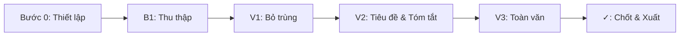

# Scholar Extractor - Nền Tảng Hỗ Trợ Nghiên Cứu SLR Chuẩn PRISMA 2020

[]()
[]()
[]()
[]()
[]()

**Scholar Extractor** là nền tảng phần mềm chuyên nghiệp phục vụ nghiên cứu tổng quan tài liệu khoa học (**Systematic Literature Review - SLR**, **Scoping Review**) tuân thủ nghiêm ngặt theo tuyên bố và sơ đồ quy trình **PRISMA 2020 (Preferred Reporting Items for Systematic Reviews and Meta-Analyses)**.

Hệ thống kết hợp giữa **Chrome Extension (Manifest V3)** với thiết kế **Wizard 6 bước có hướng dẫn tuyến tính** và **Backend Node.js/TypeScript** (kết nối Microsoft SQL Server hoặc Local Fallback), hỗ trợ pipeline từ thiết lập đề tài, thu thập đa nguồn, loại trùng mờ, sàng lọc tiêu đề/tóm tắt, thẩm định toàn văn $\ge 4$ trang, cho đến đối soát số học và xuất 9 báo cáo chuẩn **APA 7th Edition**.

---

## 🚀 Luồng Sử Dụng: Wizard Tuyến Tính 6 Bước

Thay thế hoàn toàn giao diện tab rời rạc trước đây, Scholar Extractor dẫn dắt người dùng qua quy trình chuẩn tắc, minh bạch:



### Điểm nhấn thiết kế giao diện:
1. **Thẻ Bước Hợp Nhất (Step Header Card)**: Luôn hiển thị tên nghiên cứu, phiên bản protocol, mục tiêu bước, luồng dữ liệu vào/ra, thanh 4 bộ đếm (Chưa xử lý, Chờ xác nhận, Đã hoàn tất, Mục tiêu Include), điều kiện đi tiếp và hướng dẫn tiếp theo.
2. **Một Nút Hành Động Chính Rõ Ràng**: Không còn nút chung *"Chạy Giai Đoạn Hiện Tại"*. Mỗi bước có một nút hành động cụ thể:
   - Bước 0: `💾 Lưu thiết lập & Sang thu thập`
   - Bước B1: `🔍 Bắt đầu thu thập bài báo`
   - Bước V1: `✨ Kiểm tra trùng lặp (Chạy Dedup)`
   - Bước V2: `⚡ Tự động quét & Sàng lọc`
   - Bước V3: `📑 Tìm toàn văn cho các bài đã chọn`
   - Bước FINAL: `📊 Xem Sơ Đồ Luồng PRISMA 2020 (Đối soát)`
3. **Nút "ℹ️ Hướng dẫn bước này"**: Hộp thoại trong ứng dụng giải đáp tức thì 6 câu hỏi chuẩn: *Khi nào dùng*, *Cần chuẩn bị gì*, *Bấm nút nào theo thứ tự*, *Kết quả mong đợi*, *Xử lý khi có lỗi*, và *Điều kiện đi tiếp*.
4. **Phân định rạch ròi 4 tầng dữ liệu**:
   - Gợi ý tự động của hệ thống (kèm lý do khoa học).
   - Quyết định độc lập của người dùng.
   - Trạng thái tải tài liệu (Đang tìm, Đã tải, Chưa tìm thấy, Lỗi mạng, Paywall).
   - Trạng thái hoàn tất công việc.

---

## 🌟 Tính Năng Nổi Bật Theo Từng Bước

### Bước 0 — Thiết lập Nghiên cứu & Protocol
- 3 chế độ: Tạo nghiên cứu mới, Tiếp tục nghiên cứu đã lưu, hoặc Nhập bản sao lưu JSON.
- Khung phân tích đa dạng: **PICO**, **PICOS**, **SPIDER**, hoặc **Custom** (cho phép đánh dấu N/A cho trường không áp dụng).
- Bảng trạng thái nguồn tìm kiếm thời gian thực: Ưu tiên nguồn mở miễn phí (**OpenAlex**), tự động kiểm tra khả năng của Semantic Scholar, Google Scholar và File Import.
- Tách bạch mục tiêu số bài mong muốn (`targetIncludedCount`) khỏi tiêu chí lựa chọn; không tự ý ép Include/Exclude để đạt chỉ tiêu.

### Bước B1 — Thu thập Bài báo (Identification)
- Tìm kiếm qua API học thuật với phân trang cursor, gợi ý chuỗi tìm kiếm từ protocol.
- Nhập tệp mẫu ngoại vi: Hỗ trợ linh hoạt **CSV**, **BibTeX (.bib)**, **RIS (.ris)**.
- Bổ sung bài báo hạt giống (**Seed DOI**) và chạy **Snowballing** ngược/xuôi (References & Citations).
- Quản lý tiến trình nền độc lập: Tiến trình tiếp tục chạy an toàn trên backend ngay cả khi người dùng đổi tab hoặc đóng popup.

### Bước V1 — Kiểm tra Trùng lặp (Deduplication)
- 4 thẻ số liệu minh bạch: Tổng bản ghi thô, Trùng DOI chắc chắn, Nghi trùng cần duyệt, và Bản ghi duy nhất.
- Xem xét nhóm nghi trùng cạnh nhau (**Side-by-Side**):
  - `🔗 Gộp bản ghi`: Gộp bản ghi phụ vào bản ghi chính, bảo toàn lịch sử provenance.
  - `⚖️ Giữ riêng`: Giữ riêng 2 bản ghi độc lập.
  - Không xóa vĩnh viễn dữ liệu gốc, hỗ trợ **Hoàn tác (Unmerge)** bất cứ lúc nào.

### Bước V2 — Sàng lọc Tiêu đề & Tóm tắt (Screening)
- Giao diện tối giản chỉ hiển thị thông tin cần thiết: Tiêu đề, Tác giả, Năm, Venue, DOI và Tóm tắt trích xuất.
- Ba quyết định duy nhất:
  - `✓ Qua vòng toàn văn` (`PassToFullText`).
  - `✗ Loại ở V2` (`Exclude` kèm lý do loại trừ).
  - `? Chưa rõ` (`Unsure`).
- **Tuyệt đối không dùng nhãn "Include cuối cùng" tại V2**.
- Xử lý bài Unsure linh hoạt: Có thể tiếp tục xem ở V2 hoặc chuyển sang V3 để tìm toàn văn mà không ép người dùng phải loại bài.

### Bước V3 — Tìm & Thẩm định Toàn văn (Eligibility)
- **Thu thập toàn văn**: Tra cứu tự động qua Unpaywall / Open Access; hỗ trợ tải file PDF từ máy hoặc lấy từ tab đang mở; phân biệt rõ trạng thái lỗi mạng với không tìm thấy; thiếu toàn văn KHÔNG tự động đồng nghĩa với loại trừ.
- **Thẩm định chuyên sâu**: Bắt buộc kiểm tra số trang $\ge 4$ trang (loại trừ theo `EC-S`), trích xuất câu bằng chứng phương pháp và số trang.
- Ba quyết định thẩm định: `Đạt tiêu chí toàn văn` (`Include`), `Loại ở V3` (`Exclude`), `Cần bổ sung bằng chứng` (`Unsure`).
- Chỉnh sửa ghi chú độc lập, không làm thay đổi quyết định đã lưu.

### Bước FINAL — Chốt Danh Sách & Xuất Báo Cáo
- Bảng đối soát kiểm toán 5 điều kiện tính toàn vẹn PRISMA 2020.
- Sơ đồ PRISMA 2020 cân bằng số học, hỗ trợ xem chi tiết từng ô (**Clickable Drilldown**).
- Phân biệt rõ kết quả tạm thời `[INTERIM]` với kết quả hoàn tất `[COMPLETE]`.
- Xuất 9 tệp dữ liệu chuẩn học thuật (CSV 10 cột PRISMA, Duplicate log, Screening decisions full, Final included, PRISMA Markdown, Evidence table, APA 7, Search log, Session backup).

### Quản Trị Thay Đổi Protocol & Tái Đánh Giá
- Nút `⚙️ Chỉnh sửa Protocol` hỗ trợ xem trước bản so sánh khác biệt (**Diff Preview**), bắt buộc nhập lý do thay đổi để lưu audit log.
- Khi có thay đổi phạm vi (Scope Change): Tự động tăng `protocolVersion`, đánh dấu các bài đã duyệt thành `isDecisionOutdated = true`, và cung cấp nút nhảy nhanh để đánh giá lại tại V2 hoặc V3.

---

## 📁 Cấu Trúc Thư Mục

```text
extension/
├── backend/                            # Backend Node.js + TypeScript
│   ├── src/
│   │   ├── db/                         # Module kết nối SQL Server & Migrations (12 bảng)
│   │   ├── pipeline/                   # Pipeline đa giai đoạn (dedupV1, screeningV2, retrievalV3)
│   │   ├── adapters/                   # Adapters đa nguồn (OpenAlex, Semantic Scholar, GS...)
│   │   ├── prisma/                     # Dịch vụ tính toán ma trận PRISMA 2020
│   │   ├── jobs/                       # Quản lý tiến trình nền & Crash Snapshot Checkpoint
│   │   ├── profiles/                   # Quản lý hồ sơ nghiên cứu, PICO & versioning
│   │   └── server.ts                   # RESTful API Express Server (Port 3001)
│   ├── tests/                          # 87/87 Unit & Regression Tests tự động
│   └── package.json
│
├── chrome_extension/                   # Tiện ích mở rộng Chrome (Manifest V3)
│   ├── manifest.json                   # Cấu hình tiện ích Chrome MV3
│   ├── popup.html                      # Giao diện Wizard 6 bước + Modals
│   ├── popup.css                       # Thiết kế giao diện hiện đại
│   ├── popup.js                        # Bundle JavaScript chính
│   └── src/
│       ├── popup.ts                    # Controller giao diện Wizard 6 bước
│       ├── presets.ts                  # Danh mục hồ sơ mẫu (SWT302, Generic, AAC)
│       └── types.ts                    # Khai báo kiểu TypeScript (WizardStep, FrameworkType...)
│
├── 01_all_records.csv                  # Dữ liệu xuất metadata bài báo (UTF-8 BOM)
├── 01_duplicate_log.csv                # Nhật ký loại trùng lặp chi tiết
├── 02_screening_decisions_full.csv     # Báo cáo quyết định từng vòng
├── 03_final_included.csv               # Danh mục bài báo đưa vào tổng quan
├── prisma-flow.md                      # Mã Mermaid PRISMA 2020 & bảng đối soát
├── evidence-table.md                   # Bảng trích xuất bằng chứng
├── 03_references_apa7.txt              # Danh mục trích dẫn chuẩn APA 7
├── search-log.md                       # Nhật ký tìm kiếm khoa học trung thực
├── HUONG_DAN_SU_DUNG.md                # Sổ tay hướng dẫn sử dụng chi tiết
└── README.md
```

---

## 🛠️ Hướng Dẫn Cài Đặt & Chạy Thử Nghiệm

### 1. Khởi Động Backend Server
```powershell
cd backend
npm install
npm run dev
```
Máy chủ khởi động tại: `http://localhost:3001`.

### 2. Biên Dịch Chrome Extension
```powershell
cd chrome_extension
npm install
npm run build
```

### 3. Cài Đặt Vào Trình Duyệt
1. Mở Chrome / Edge và truy cập `chrome://extensions/`.
2. Bật **Developer mode** ở góc phải trên.
3. Nhấp **Load unpacked** và chọn thư mục `chrome_extension`.
4. Mở tiện ích để trải nghiệm quy trình Wizard 6 bước!

### 4. Kiểm Thử Hệ Thống (Automated Test Suite)
```powershell
cd backend
npm test
```
Bảo đảm toàn bộ **87/87 kịch bản kiểm thử tự động Pass (0 Fail)**.

---
*Phát triển bởi Duykhobo & Antigravity IDE. Tuân thủ nghiêm ngặt chuẩn PRISMA 2020 và APA 7th Edition.*
